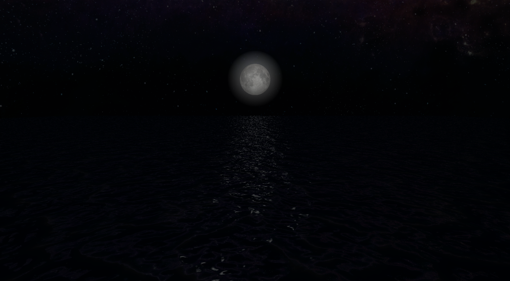

# Moonlight Raytracer

This program is uses ray tracing to create a single beautiful image from a scene. It was written by Jordan Conragan for his 116a class at San Jose State University during the Fall 2020 semester. The primary goal of this raytracer was to generate the image below:

## Features of the Ray Tracer

* Generates a single image of a scene using ray tracing

* Supports plane, sphere, and cube primitive objects

* Objects can be reflective

* Objects can be transparent

* Supports textured objects

* Supports normal mapping

* Supports displacement mapping (due to it's implementation, it is slow)
